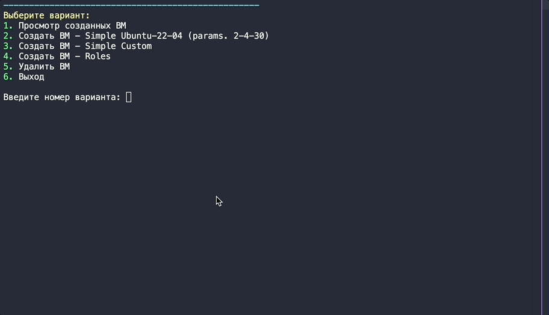
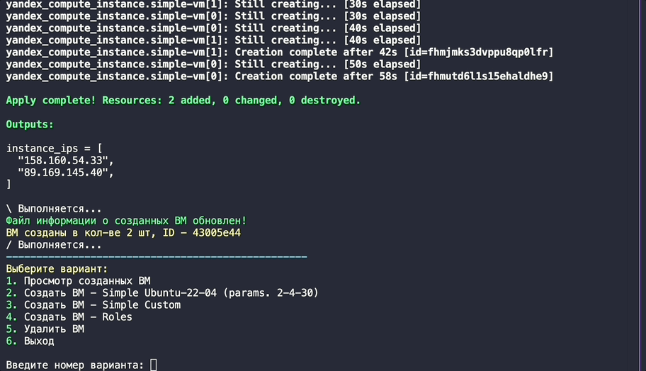

# Python Cloud Manager

## Описание

**Python Cloud Manager** — это проект для управления виртуальными машинами и облачными ресурсами с использованием Python. Этот проект служит моей тренировочной площадкой для изучения программирования на Python и работы с облачными сервисами.
>Далее проект будет служить основой для проекта `бота в Telegram`

## Функциональность

В проекте реализованы следующие функции:

- Создание виртуальных машин (ВМ) в облаке;
- Удаление виртуальных машин;
- Просмотр списка созданных виртуальных машин (файл `vm_data.json`);
- Интерактивный консольный интерфейс для выбора действий;
- Задание характеристик ВМ;
- Заготовленные роли - `nginx`, `docker`, `nexus`, `prometheus + grafana + node exporter`

## Интерфейс

- 
---
- 
---
- 
---

## Технологии

- Python
- Terraform
- Ansible
- Yandex Cloud

## Предварительные требования

1. Аккаунт в Yandex Cloud.
2. Установленный [Terraform](https://yandex.cloud/ru/docs/tutorials/infrastructure-management/terraform-quickstart).
3. Установленный [Ansible](https://docs.ansible.com/ansible/latest/installation_guide/intro_installation.html).
4. Установленный [Yandex Cloud CLI](https://cloud.yandex.ru/docs/cli/quickstart).
5. Полученный [OAuth-токен](https://yandex.cloud/ru/docs/iam/concepts/authorization/oauth-token).
6. В корне репозитория должен лежать SSH-keys - **id_ed25519.pub и id_ed25519**
7. Заполненный файл **creds.auto.tfvars**

    ```terraform
    token     = ""
    cloud_id  = ""
    folder_id = ""
    ```
